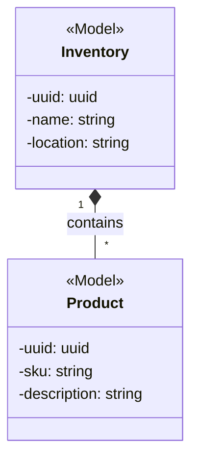

# mini-erp

```mermaid
classDiagram
  class Inventory {
    <<Model>>
    -uuid: uuid
    -name: string
    -location: string
  }

  class Product {
    <<Model>>
    -uuid: uuid
    -sku: string
    -description: string
  }

  Inventory "1" *-- "*" Product : contains
```