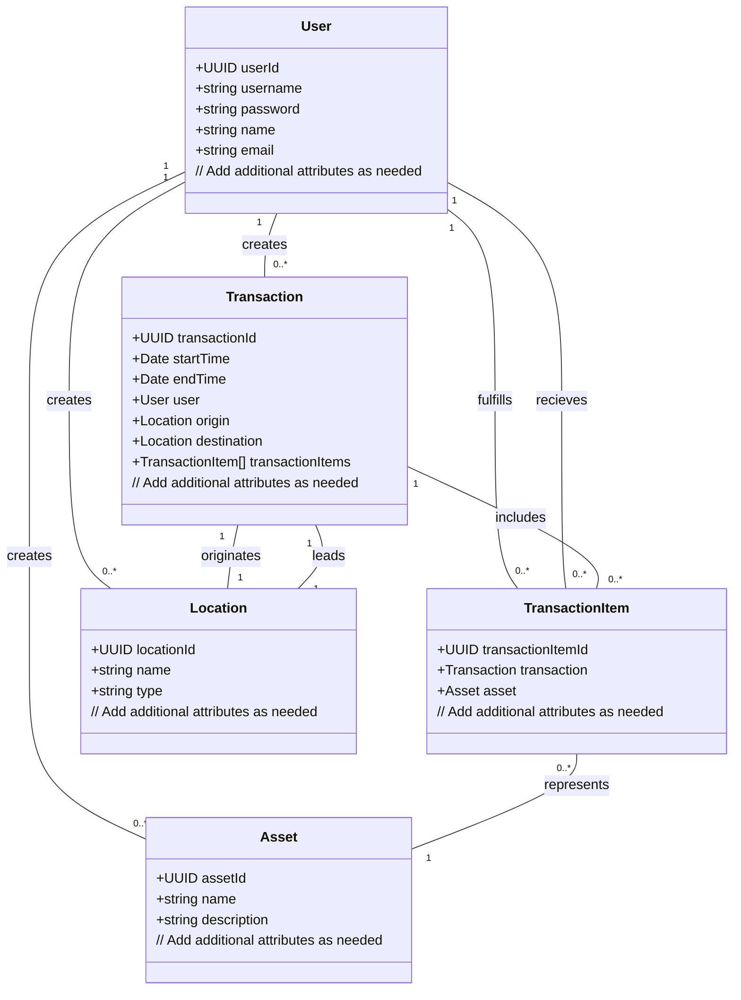

# Mini-ERP

Welcome to the Mini-ERP project! This is a simple enterprise resource planning application built with Node.js and the Sequelize ORM.

## Prerequisites

Before you get started with this project, you'll need to have the following installed on your computer:

- Node.js
- pnpm

You'll also need a database installed and running on your computer. This project supports multiple database dialects, so you can choose whichever one you prefer.

## Installation

To install the Mini-ERP application, follow these steps:

1. Clone the project repository to your local machine.
2. Navigate to the project directory in your terminal.
3. Run `pnpm install` to install the project dependencies.

## Sequelize Dialects

Before you can use Mini-ERP with a specific database dialect, you'll need to install the corresponding Sequelize dialect package globally using pnpm.

For example, if you want to use Mini-ERP with PostgreSQL, you'll need to install the `pg` and `pg-hstore` packages globally:

```
pnpm install -g pg pg-hstore
```

If you want to use Mini-ERP with MySQL, you'll need to install the `mysql2` package globally:

```
pnpm install -g mysql2
```

For a full list of supported Sequelize dialects and their corresponding packages, see the [Sequelize documentation](https://sequelize.org/).

## Configuration

Before you can start the Mini-ERP application, you'll need to configure a few things.

1. Create a new file in the root directory of the project called `.env`.
2. In this file, add the following environment variables:

```
PORT=5001
SECRET_KEY=<your_secret_key>
DB_USER=<your_database_username>
DB_PASSWORD=<your_database_password>
DB_NAME=<your_database_name>
DB_DIALECT=<your_database_dialect>
DB_HOST=<your_database_host>
DB_PORT=<your_database_port>
```

Replace `<your_secret_key>`, `<your_database_username>`, `<your_database_password>`, `<your_database_name>`, `<your_database_dialect>`, `<your_database_host>`, and `<your_database_port>` with your own values.

You can choose one of the supported database dialects for Sequelize. For example, for PostgreSQL, you would set `DB_DIALECT=postgres`.

## Usage

To start the Mini-ERP application, run the following command in your terminal:

```
pnpm start
```

This will start the application in production mode.

If you want to start the application in development mode, run the following command instead:

```
pnpm run dev
```

This will start the application with nodemon, which will automatically restart the application whenever you make changes to the code.

## Class Diagram

The following diagram shows the relationship between the Sequelize models:


